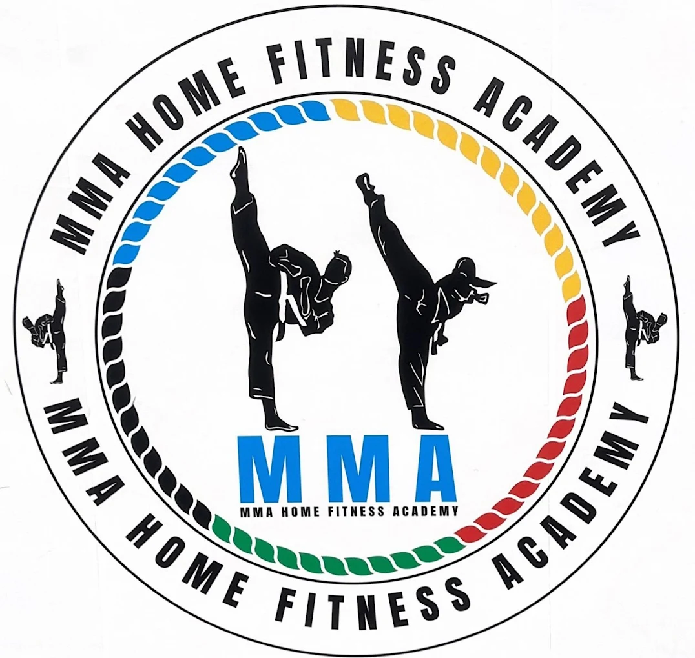

<div align="center">



# 🥊 MMA HomeFitness Academy

### *Train Elite. Train at Home.*

**Professional martial arts & fitness coaching delivered to your doorstep — across all 7 UAE Emirates.**

[](https://safwatsohail.github.io/classic-mama-website-)
[](https://www.instagram.com/home.fitness.mma/)
[](https://www.tiktok.com/@mma_home_fitness)
[](https://api.whatsapp.com/send/?phone=971545425490)

---

</div>

## 📖 About

**MMA HomeFitness Academy** is a fully responsive, bilingual (🇬🇧 English / 🇦🇪 Arabic) website for a UAE-based home fitness service. Certified coaches travel directly to clients' homes anywhere in the UAE — no commute, no gym membership, just elite training on your schedule.

> 🏆 **200+ happy clients** &nbsp;|&nbsp; 📍 **All 7 UAE Emirates** &nbsp;|&nbsp; ⏱ **12 years of experience**

---

## ✨ Features

| Feature | Details |
|---|---|
| 🌍 **Bilingual** | Full English & Arabic (RTL) with `localStorage` language persistence |
| 🎬 **Hero Video** | Full-screen background video on landing |
| ⚡ **Smooth Animations** | IntersectionObserver scroll-reveal on all sections |
| 📱 **Responsive** | Mobile-first with smart overflow-detecting hamburger menu |
| 🎠 **Testimonial Slider** | Auto-advances every 3s with dot navigation |
| 📋 **Contact Form** | FormSubmit-powered with success feedback |
| 💬 **Contact Bubble** | Sticky CTA button appears after scrolling past hero |
| 🔼 **Scroll-to-Top** | Smooth-scroll button appears after 300px |
| 🗺️ **Google Maps Embed** | Interactive map to the head office |
| ♿ **Accessible** | ARIA labels, semantic HTML, keyboard navigation |

---

## 🥋 Programs

<div align="center">

| Combat Arts | Fitness |
|:---:|:---:|
| 🥊 Boxing | 🏃 Cardio Boxing |
| 🦵 Kickboxing | 🏋️ Weight Loss |
| 🥋 Muay Thai | 🧘 Yoga |
| ⚔️ MMA | 💃 Zumba |
| 🎽 Taekwondo | 🩺 Physical Therapy |
| 👊 Karate | 💪 Overall Fitness |

</div>

---

## 🎯 Specialized Training

- 🏠 **Private Coaching** — one-on-one at home, matched to your discipline
- 👦 **Youth Kickboxing** — energy, focus & fun for kids
- 👥 **Group Classes** — community training, all levels welcome
- 👩 **Women-Only Training** — empowering, safe, female-led sessions
- 💥 **Strength & Conditioning** — science-backed performance training
- 🧒 **Kids Martial Arts** — discipline & confidence through play
- 🤸 **Flexibility & Recovery** — mobility, stretching & injury prevention
- 🛡️ **Self-Defense** — practical real-world protection skills

---

## 👨‍🏫 Our Coaches

| Coach | Specialty | Experience |
|---|---|---|
| **Coach Sakina** | MMA & Muay Thai | 7+ yrs · Former pro fighter |
| **Coach Abdul Majid Aqqawi** | Karate & Taekwondo | Black belt · Youth & self-defense |
| **Coach Jihan Almezyaty** | Boxing, Zumba, Aerobics, Rehab | 8 years |
| **Coach Dunya Al-Muzayyati** | Rehabilitation & Yoga | Licensed practitioner |
| **Coach Abdulaziz Tayseer** | Taekwondo, Muay Thai, Boxing | 6 years |
| **Coach Idrees Jarfi** | Muay Thai, Boxing, Rehab | 9 years |
| **Coach Sanaa Al-Bukhari** | Kickboxing, Zumba, Rehab | 6 years |
| **Coach Atika Al-Fattoumi** | Taekwondo, Boxing, Body Sculpting | 7 years |

---

## 🗂️ Project Structure

```
📁 hammadisannoying/
├── index.html                  # Main single-page website
├── style-blue-white-final.css  # Active stylesheet (blue & white theme)
├── script.js                   # All JS — nav, slider, i18n, animations
├── 📁 i18n/
│   ├── en.json                 # English translations
│   └── ar.json                 # Arabic translations (RTL)
├── logo.png                    # Academy logo
├── hero_video.mp4              # Hero section background video
└── *.jpg / *.png               # Coach & training photos
```

---

## 🛠️ Tech Stack


- **No frameworks, no build tools** — pure HTML/CSS/JS, zero dependencies to install
- **i18n** via JSON fetch + `data-i18n` attribute system
- **Hosting-ready** — drop files on any static host (GitHub Pages, Netlify, etc.)

---

## 🚀 Running Locally

```bash
# Clone the repo
git clone https://github.com/Safwatsohail/classic-mama-website-.git

# Open in browser — any local server works
npx serve .
# or just open index.html directly in your browser
```

> ⚠️ The i18n language fetch requires a local server (not `file://`). Use `npx serve`, VS Code Live Server, or similar.

---

## 📬 Contact

| Channel | Info |
|---|---|
| 📧 Email | homefitnessmmaacademy@gmail.com |
| 📞 WhatsApp | [+971 54 542 5490](https://api.whatsapp.com/send/?phone=971545425490) |
| 📍 Address | Marhaba Mall, Ras Al Khor Industrial Area 3, Dubai, UAE |
| 📸 Instagram | [@home.fitness.mma](https://www.instagram.com/home.fitness.mma/) |
| 🎵 TikTok | [@mma_home_fitness](https://www.tiktok.com/@mma_home_fitness) |

---

<div align="center">

**© 2024 MMA HomeFitness Academy · Dubai, UAE**

*Discipline. Integrity. Focus.*

</div>
